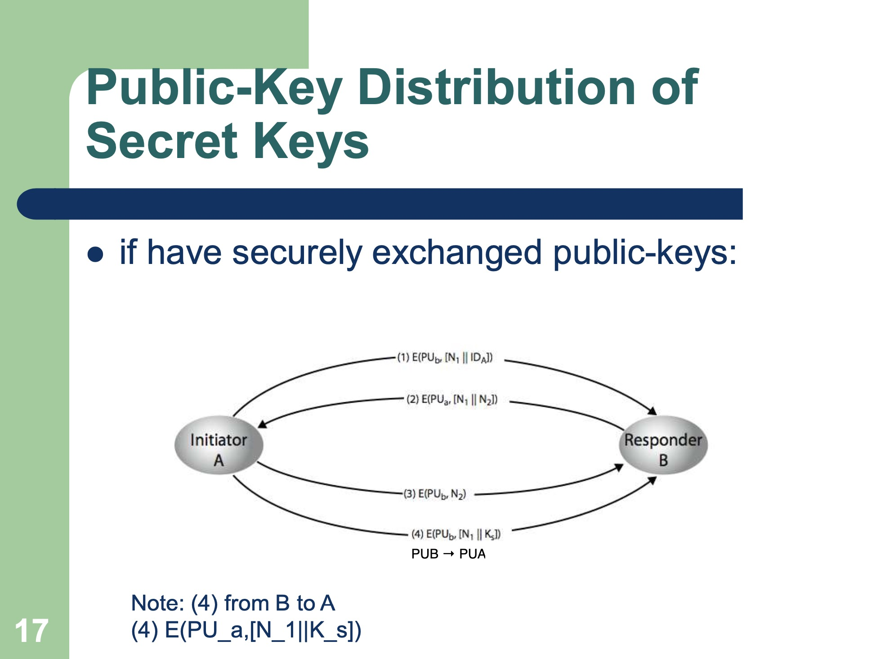
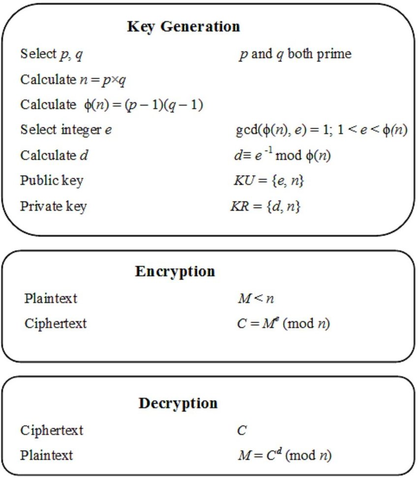
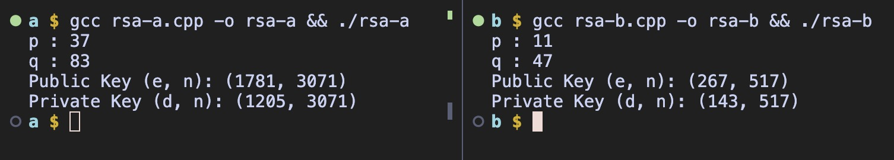
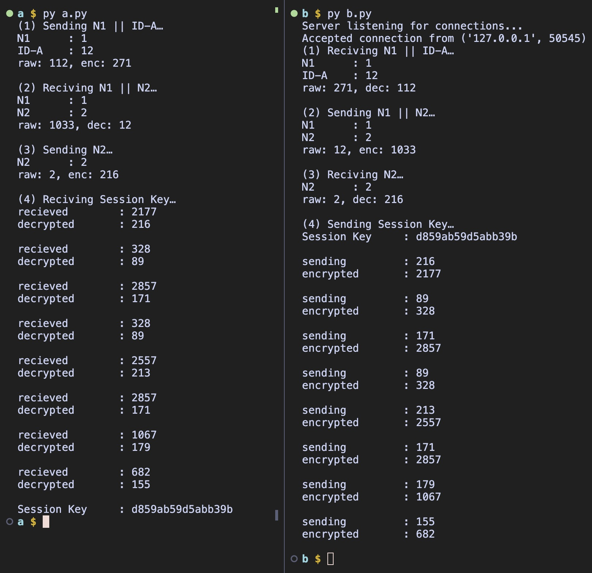

# Keamanan Infomasi - RSA

Implementasi distribusi secret key menggunakan RSA pada 2 komputer

Diagram Distribusi secret key:



Note :
* (4) from B to A
* (4) $E(PU_a,[N_1 || K_S])$

Pada implemetasi kali ini saya menggambarkan 2 komputer A & B menggunakan 2 folder A dan B yang masing masing berisikan program untuk generate public dan private key serta program untuk mendistribusi secret key. Untuk mempermudah visualisasi, saya menyimpan semua key yang dimiliki tiap komputer (program) dapa file `.key`, yang berisikan kedua pihak public key, masing-masing private key, dan masing-masing `N` dan `ID`

## Cara Kerja

### Generating Key

sebelum melakukan distribusi, perlu digenerate terlebih dahulu key public dan private. berikut adalah diagram simple algoritma RSA-nya:



note: untuk mempersimple implementasi, saya hanya menggunakan angka prima dari batasan $0 < 100$

saya menggunakan cpp dalam membuat dan menyebarkan public key yang telah dibut

```cpp
class Key {
   private:
    pair<int, int> publicKey;
    pair<int, int> privateKey;

    void setPublicKey(int e, int n) { publicKey = make_pair(e, n); }

    void setPrivateKey(int d, int n) { privateKey = make_pair(d, n); }

   public:
    Key() = default;

    // Constructor to initialize keys securely
    Key(int e, int n, int d, int m) {
        setPublicKey(e, n);
        setPrivateKey(d, m);
    }

    pair<int, int> getPublicKey() { return publicKey; }

    pair<int, int> getPrivateKey() { return privateKey; }

    int gcd(int a, int h) {
        // function returning Greatest common divisor
    }

    int randNum(int n) { 
        // funtion returning random number less than n more than 0
    }

    bool isPrime(int n) {
        // funtion returning whether n is prime
    }

    int modInverse(int a, int m) {
        // function returning mod inverse of a and m
    }

    void generateKey() {
        vector<int> prime;

        for (int i = 0; i < 100; i++) {
            if (isPrime(i)) prime.push_back(i);
        }

        // take 2 random prime numbers
        int p = prime[randNum(prime.size())];
        int q = prime[randNum(prime.size())];

        // if q is the same as p
        while (p == q) q = prime[randNum(prime.size())];

        printf("p : %d\nq : %d\n", p, q);

        int n = p * q;
        int phi = (p - 1) * (q - 1);

        vector<bool> selected(prime.size(), false);
        int e = randNum(phi);
        while (1) {
            if (gcd(e, phi) == 1)
                break;
            else
                e = (e + 1) % phi <= 1 ? 2 : (e + 1) % phi;
        }

        // Calculate the private exponent (d) such that (d * e) % phi = 1
        int d = modInverse(e, phi);

        // Set the keys directly in the current object
        setPublicKey(e, n);
        setPrivateKey(d, n);
    }
};
```
### Distributing

Seperti pada diagram distribusi diatas, Dua program berjalan bersamaan saling bertukar pesan yang telah dienkripsi menggunakan algoritma RSA. Pada implementasi saya saya menggunakan python sebagai program distribusi. B sebagai server dan A sebagai client.

untuk mempermudah visualisasu saya juga memisahkan setiap step enkripsi dan dekripsi menjadi fungsi yang berbeda. 

setelah berhasil didistribusikan, secret key akan disimpan di `.key/symmetric_key.txt` pada masing-masing folder

## Hasil

berikut adalah screenshots hasil output dari program yang saya buat

### Generating Key



### Distributing




